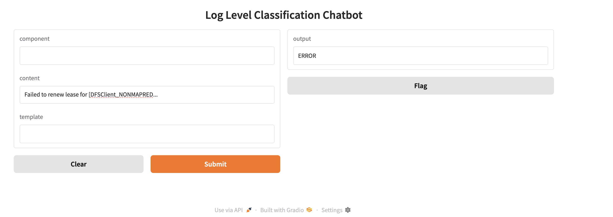

# 🤖 chatbot_logs: Transformer-Based Log Level Classification

## 📊 Transformer-Based Log Level Classification Interactive Report

## 📘 Overview
This repository contains an interactive single-page application (SPA) that showcases a complete ML pipeline for automated log severity classification using Transformer models.
The core objective of this project is to leverage the power of Transformer models (specifically DistilBERT) to perform rapid, high-confidence severity analysis, significantly improving log monitoring and incident response workflows.

The report provides a complete narrative, from initial data exploration (EDA) through the machine learning pipeline, culminating in an interactive demonstration of the final classifier.

## 🚀 Key Features

- **Interactive Data Exploration**  
  Visualize log level distribution, temporal trends, and component-specific breakdowns using Chart.js.

- **Visual ML Pipeline**  
  Step-by-step breakdown of feature engineering, tokenization, model selection, and training.

- **Simulated Interactive Demo**  
  Input custom log details and receive real-time classification predictions (`WARN`, `INFO`, `ERROR`, `FATAL`).

- **Responsive Design**  
  Built with vanilla JavaScript, HTML, and Tailwind CSS for optimal viewing on all devices.


### 💻 Technical Details
| Category       | Library/Module                | Purpose                                                                 |
|----------------|-------------------------------|-------------------------------------------------------------------------|
| Deep Learning  | `PyTorch`, `transformers`     | Core framework and access to pre-trained Transformer models (DistilBERT). |
| Data Handling  | `Pandas`, `NumPy`             | Data manipulation, feature engineering, and numerical processing.       |
| ML Utilities   | `Scikit-learn` (`train_test_split`) | Splitting data into training and evaluation sets.                  |
| Datasets       | `Hugging Face Datasets`       | Efficient data loading and processing for Transformer training.         |
| Evaluation     | `Hugging Face Metrics`        | Calculating custom classification metrics (F1-score, Accuracy).         |


## 1. Problem Statement:
Infrastructure logs grow rapidly, non-technical support teams are increasingly tasked with assessing log severity from ticket content. Empowering them with a chatbot that interprets log severity reduces triage time for low-priority issues, updates ticket severity automatically, and engineers to focus on critical incidents.

### Context:
As infrastructure scales, the volume of system logs grows rapidly, making manual triage increasingly inefficient. Non-technical support teams receive tickets containing severity levels and raw logs, but these severity labels are often misaligned with the actual log content and summary. This leads to redundant triage efforts by engineers, reducing their productivity. By enabling support teams to validate and update ticket severity based on log analysis, we can streamline triage and allow engineers to focus on high-impact tasks.

### Solution Overview:
Empowering them with a chatbot that interprets log severity reduces triage time for low-priority issues, updates ticket severity automatically, and engineers to focus on critical incidents.

### Product Outcome:
The top Severity tasks are  prioritized and are completed on time before it creates a bigger issue.

## Key data sources:
The Data used for training are 2 Csv file that has logs for various types of Logs for Hadoop and Zookeeper.
Model input is formed by combining Component, Content, and EventTemplate fields.

## 2. Data Wrangling:
####  <i> 🗂️ About the Data </i>
The dataset contains 4,000 rows of log entries from Hadoop and Zookeeper systems. Both share common columns: LineId, Date, Time, Level, Component, Content, EventId, EventTemplate, and LogType. Hadoop includes an extra column Process, while Zookeeper includes Node.

####  <i>  🔧 Wrangling Steps:  </i> 
Unified schema: The extra columns (Process and Node) are renamed to AdditionalInformation, stored as stringified dictionaries with <column_name>: value format.

Source tagging: A new column LogType is added to label each entry as either "Hadoop" or "Zookeeper".

Data integration: Both logs are merged into a single DataFrame called data_logs.

Missing values: Checked and handled appropriately.

Timestamp creation: Date and Time columns are merged and converted to datetime format.

Template cleanup: EventTemplate strings are cleaned using regex—extra spaces are removed and replaced with <VAR>.

Target normalization: The Level column is normalized to assess class balance.

Input formatting: A new column input is created as a dictionary containing Timestamp, LogType, Component, Content, EventId, and EventTemplate.

```python
input_text = log['Component'] + " | " + log['Content'] + " | " + log['EventTemplate']
```

Tokenization: The input text is converted into a numerical sequence using the pre-trained distilbert-base-uncased tokenizer.

## 3. EDA
📊 Visual Insights
Log Level Distribution: Bar plot showing frequency of each log level.

Temporal Trends: Stacked bar chart visualizing log levels over time.

Frequent Errors: Top 20 components with the most error logs, visualized alongside EventTemplate frequency.

Token Count Analysis: Histogram of token counts per log entry—over 80% have fewer than 20 tokens.

Component-Level Patterns: Grouped analysis of Component and Level to identify recurring combinations.

Log Rate: Line plot showing number of logs per minute.

Token Length by Level: Average token count per log level.

Normalized Component-Level Distribution: Stacked bar chart showing percentage breakdown of log levels within top components.

Label Encoding of the Log LEVEL is done.
target   Level
0        ERROR
1        FATAL
2        INFO
3        WARN

Export the final cleaned data to support both exploratory analysis and machine learning modeling.

## 4. Data Pre Processing

The dataset is split into features and a target column.

The feature set (X) is constructed by combining Timestamp, LogType, Component, Content, EventId, and EventTemplate into a single column named input.

The target variable (y) corresponds to the Level column, representing the log severity.

To ensure balanced representation across log levels, the data is divided into training and testing sets using stratified sampling, with 80% allocated for training and 20% for testing.

## 🧠 Model Pipeline Summary


## 5. Modelling:

Model Architecture: A sequence classification head is added atop the DistilBERT base model. The entire network is fine-tuned on the labeled log dataset.

📦 Dataset Wrapping Raw log data (X_train, y_train, X_test, y_test) is converted into Hugging Face Dataset objects using Dataset.from_dict(). This enables efficient mapping and integration with Hugging Face workflows.

🧩 Input Formatting Each log entry is preprocessed into a unified string format combining Timestamp, LogType, Component, Content, EventId, and EventTemplate. This composite input is stored under the "text" field.

✂️ Tokenization Function A custom tokenize() function is defined using a pretrained DistilBERT tokenizer. It applies padding="max_length" and truncation=True to standardize input length and prevent overflow.

🗂️ Tokenized Dataset Mapping The tokenize() function is applied to both training and testing datasets using .map(batched=True), producing tokenized versions with input_ids, attention_mask, and label.

⚙️ Training Configuration Training hyperparameters are defined using TrainingArguments, including batch size, number of epochs, output directory, and logging path.

🚀 Trainer Initialization A Trainer object is instantiated with the model, training arguments, tokenized datasets, and optionally a compute_metrics function for evaluation.

📈 Model Training The model is trained using trainer.train(), which handles batching, optimization, and epoch-wise updates internally.

🔍 Model Evaluation After training, trainer.evaluate() is called to assess performance on the test set. Metrics like accuracy, precision, recall, and F1-score can be computed using a custom compute_metrics() function.

💾 Model Export The trained model is saved using trainer.save_model(), and the tokenizer is saved separately with tokenizer.save_pretrained() for consistent inference.

📤 Downstream Inference Ready The saved model and tokenizer can now be loaded for real-time log classification, integrated into a pipeline, or deployed via API or cloud service.

### Metrics Evaluation: 

The model was trained to classify log entries into four severity levels:

0 → ERROR

1 → FATAL

2 → INFO

3 → WARN

The evaluation was conducted on a test set of 800 samples, and the results reveal significant class imbalance and prediction bias.

📈 Class-wise Performance

| Class | Label | Precision | Recall | F1-Score | Support |
|-------|-------|-----------|--------|----------|---------|
| 0     | ERROR | 1.00      | 0.97   | 0.98     | 33      |
| 1     | FATAL | 0.00      | 0.00   | 0.00     | 0       |
| 2     | INFO  | 0.45      | 1.00   | 0.62     | 342     |
| 3     | WARN  | 0.00      | 0.00   | 0.00     | 425     |

ERROR (0): The model performs exceptionally well, with near-perfect precision and recall.

FATAL (1): No predictions were made for this class, likely due to its absence in the test set or extreme underrepresentation in training.

INFO (2): High recall but low precision suggests the model over-predicts this class, leading to many false positives.

WARN (3): The model fails to identify any samples from this class, despite it being the largest in the test set.

📊 Aggregate Metrics
Accuracy: 46.75% — less than half of the predictions were correct.

Macro Average:

Precision: 0.36

Recall: 0.49

F1-Score: 0.40 Treats all classes equally, highlighting poor performance on FATAL and WARN.

Weighted Average:

Precision: 0.23

Recall: 0.47

F1-Score: 0.30 Accounts for class imbalance. Dominated by performance on INFO and WARN.

⚠️ Key Findings
Severe class imbalance: FATAL had 0 support in the test set, and likely very few samples in training.

Model bias toward INFO: It predicts INFO frequently, even when incorrect.

Poor generalization: The model fails to recognize WARN, which had the highest support (425 samples).

🛠 Recommendations
Resample or augment minority classes (e.g., FATAL, ERROR) to improve representation.

Use class weights or focal loss to penalize misclassification of rare classes.

Perform error analysis to understand feature overlap between INFO and WARN.

Visualize predictions with a confusion matrix to identify misclassification patterns.

Consider stratified sampling during train-test split to ensure all classes are represented.

Severe class imbalance: With only 2 samples out of 4000, the FATAL class represents just 0.05% of the dataset.

Model bias toward frequent classes: Transformers trained with cross-entropy loss tend to favor majority classes unless explicitly corrected.

No learned signal: With so few examples, the model likely didn’t learn meaningful patterns for FATAL, resulting in zero predictions.

#### Validation
The cahtbot is validated  for testing.

## Chatboot UI


